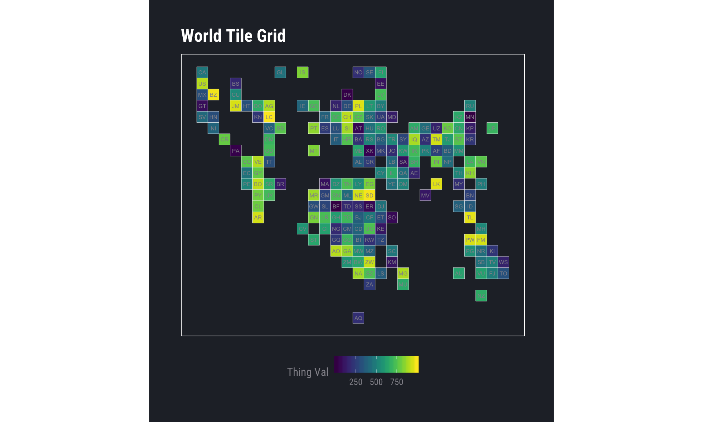
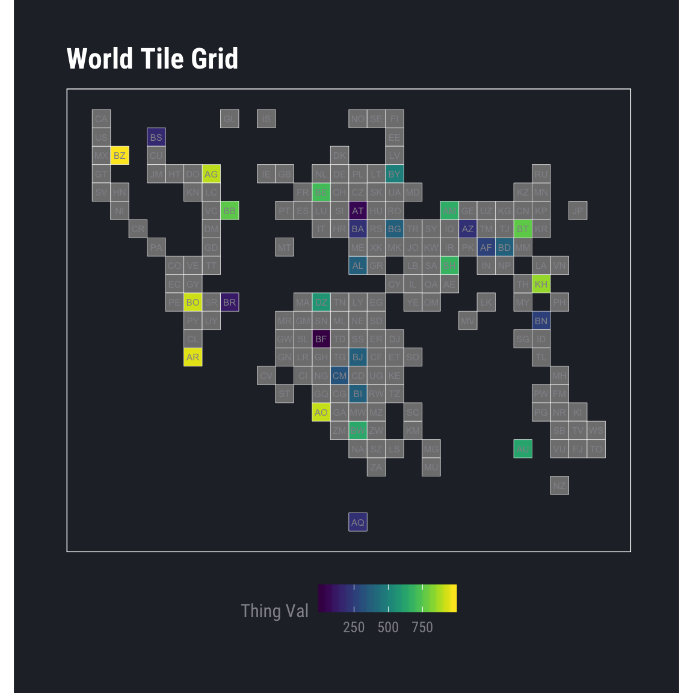
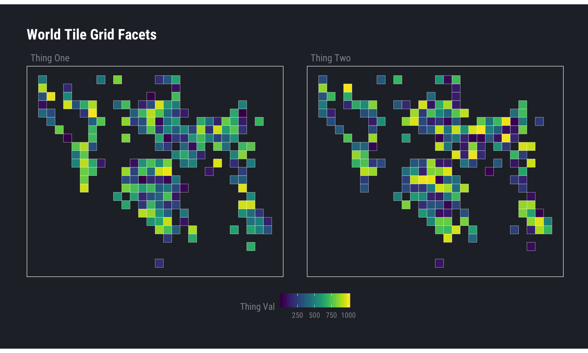
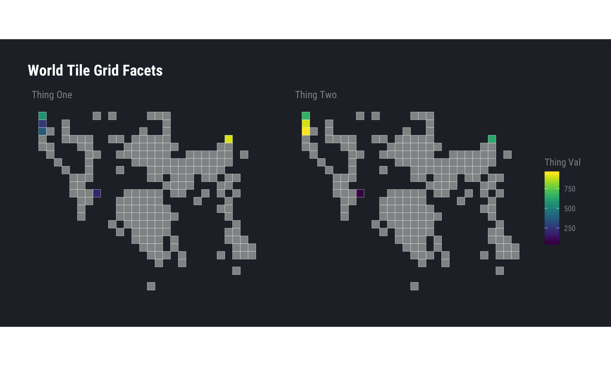

[](https://travis-ci.org/hrbrmstr/worldtilegrid)

# worldtilegrid \[WIP\]

A ggplot2 Geom for World Tile Grids

## Description

A “tile grid map” is a cartogram that uses same-sized tiles in
approximate, relative positions of each other to represent a world map.
The world tile grid relative position reference system used by this
‘ggplot2’ ‘Geom/Stat’ was the original work of ‘Jon Schwabish’ and
converted to ‘CSV’ by ‘Maarten Lambrechts’.

  - Ref: <https://policyviz.com/2017/10/12/the-world-tile-grid-map/>
  - Ref:
    <http://www.maartenlambrechts.com/2017/10/22/tutorial-a-worldtilegrid-with-ggplot2.html>

## What’s Inside The Tin

The following functions are implemented:

  - `geom_wtg` / `stat_wtg`: World Tile Grid Geom/Stat
  - `theme_enhance_wtg` World tile grid theme cruft remover that can be
    used with any other theme

The following *data* is included/exported:

`wtg`: World Tile Grid Basemap Data

## Installation

``` r
devtools::install_github("hrbrmstr/worldtilegrid")
```

## Usage

``` r
library(worldtilegrid)
library(tidyverse)

# current verison
packageVersion("worldtilegrid")
```

    ## [1] '0.1.0'

### Example (All countries are in the data set)

``` r
set.seed(1)
data_frame(
  ctry = worldtilegrid::wtg$alpha.3,
  `Thing Val` = sample(1000, length(ctry))
) -> xdf

ggplot(xdf, aes(country = ctry, fill = `Thing Val`)) +
  geom_wtg() +
  geom_text(aes(label = stat(alpha.2)), stat="wtg", size=2) + # re-compute the stat to label
  coord_equal() +
  viridis::scale_fill_viridis() +
  labs(title = "World Tile Grid") +
  hrbrthemes::theme_ft_rc() +
  theme_enhance_wtg()
```



### Example (Only a few countries are in the data set)

``` r
set.seed(1)
data_frame(
  ctry = worldtilegrid::wtg$alpha.3[1:30],
  `Thing Val` = sample(1000, length(ctry))
) -> xdf

ggplot(xdf, aes(country = ctry, fill = `Thing Val`)) +
  geom_wtg() +
  geom_text(aes(label = stat(alpha.2)), stat="wtg", size=2) + # re-compute the stat to label
  coord_equal() +
  viridis::scale_fill_viridis() +
  labs(title = "World Tile Grid") +
  hrbrthemes::theme_ft_rc() +
  theme_enhance_wtg()
```



### Facet Example (All countries are in the data set)

``` r
set.seed(1)
data_frame(
  ctry = worldtilegrid::wtg$alpha.3,
  `Thing Val` = sample(1000, length(ctry)),
  grp = 'Thing One'
) -> xdf1

data_frame(
  ctry = worldtilegrid::wtg$alpha.3,
  `Thing Val` = sample(1000, length(ctry)),
  grp = 'Thing Two'
) -> xdf2

bind_rows(
  xdf1,
  xdf2
) -> xdf

ggplot(xdf, aes(country = ctry, fill = `Thing Val`)) +
  geom_wtg() +
  coord_equal() +
  facet_wrap(~grp) +
  viridis::scale_fill_viridis() +
  labs(title = "World Tile Grid Facets") +
  hrbrthemes::theme_ft_rc() +
  theme_enhance_wtg()
```



### Facet Example (Only a few countries are in the data set)

The geom will fill in the gaps for you:

``` r
set.seed(1)
data_frame(
  ctry = c("USA", "MEX", "CAN", "RUS", "BRA"),
  `Thing Val` = sample(1000, length(ctry)),
  grp = 'Thing One'
) -> xdf1

data_frame(
  ctry = c("USA", "MEX", "CAN", "RUS", "BRA"),
  `Thing Val` = sample(1000, length(ctry)),
  grp = 'Thing Two'
) -> xdf2

bind_rows(
  xdf1,
  xdf2
) -> xdf

ggplot(xdf, aes(country = ctry, fill = `Thing Val`)) +
  geom_wtg() +
  coord_equal() +
  facet_wrap(~grp) +
  viridis::scale_fill_viridis(na.value = hrbrthemes::ft_cols$gray) +
  labs(title = "World Tile Grid Facets") +
  hrbrthemes::theme_ft_rc() +
  theme_enhance_wtg()
```


